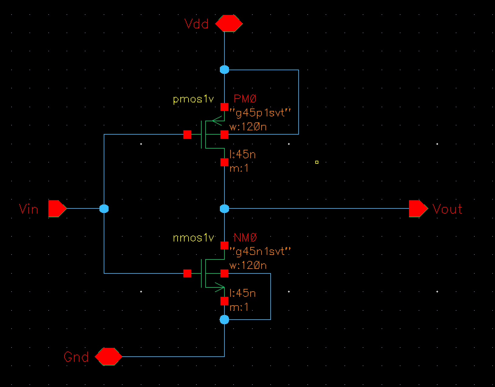

<h1 style="text-align: center;">Design The Circuit-level Implementation Of A Configurable Logic Block (CLB) Comprised Of A Single Basic Logic Element(BLE) Including SRAM, LUT and D Flip-Flop</h1>

Univerisity of Pennsylvania ESE5700 

Jiajun Chen & Venkateswara Koduri 12/4/2024

<!-- 

    
    

    <strong>Figure 8:</strong> The 3D Module of The Wand

 -->

# 1. Design Schematics

## 1.1 5T SRAM

The Schematic of 5T SRAM is shown below. The width of the NMOS transistor connected to the word line is 1.21 um, while the widths of all other PMOS and NMOS transistors are 120 nm.

    

<strong>Figure : </strong> The Schemaic of 5T SRAM

The schematic diagram of the inverter in above 5T SRAM and symbol of the 5T SRAM are shown below:

    
    

    <strong>Figure 8:</strong> The Schematic of the inverter and the symbol of the 5T SRAM

Next, we assemble 5T SRAMS to be 16 bits SRAM, the schematic and the symbol are shown belwo:

# 2. Design Description

## 2.1 5T SRAM

### 2.1.1 Design of a 5T SRAM Cell

In this section, we propose the design of a 5T SRAM cell, as it is expected to demonstrate improved performance and higher density compared to the traditional 6T SRAM design. 

    

<strong>Figure : </strong> The Configuration of The 5T SRAM

The key components of the 5T SRAM cell and their functions are detailed as follows:

**Key Components**

1. **Cross-Coupled Inverters:**
The 5T SRAM cell incorporates two cross-coupled inverters that serve as bistable elements for data storage. These inverters are connected such that the output of one inverter is fed into the input of the other, forming a feedback loop. This configuration ensures a stable storage of binary states (0 or 1), as it maintains either a strong 0 or a strong 1 under normal operating conditions.
2. **Inverter for Load Signal Control:**
An additional inverter is included to manage the load input signal. This inverter performs two crucial functions:

* **Transmission Gate Activation:** When the load input is high, the inverter output becomes low, enabling the PMOS gate of the transmission gate to open. This allows data to be written into the cross-coupled inverters. Conversely, when the load input is low, the transmission gate is closed, preventing any unintended write operations, thereby satisfying the load requirement (i.e., the load signal is high during SRAM write operations).
* **Precharge Disabling:** When the load input is high (during a write operation), the inverter ensures that the NMOS connected to the precharge input is turned off. This prevents the precharge circuit from discharging to 0 V during the write operation, ensuring a clear distinction between read and write states.

3. **Transmission Gate**
The design includes a transmission gate composed of one NMOS and one PMOS transistor. This gate operates as follows:

* When the load input is high, the transmission gate opens, allowing the data input to be written into the cross-coupled inverters.

* When the load input is low, the transmission gate closes, effectively isolating the data input from the storage elements.

4. **Single NMOS Transistors**
The 5T SRAM schematic features three single NMOS transistors with the following roles:

* **Word Line NMOS:** This transistor is connected to the word line. When the word line is high, it allows the stored data to be read out via the bit line output.

* **Precharge NMOS:** This transistor is connected to the precharge input. When the precharge signal is high, it charges the relevant node to 0 V to facilitate subsequent read operations.

* **Precharge-Control NMOS:** Positioned below the precharge NMOS, this transistor ensures that the precharge mechanism is disabled during write operations, as previously described.

### 2.1.2 Operational Description

**Writing Data**

1. **Initialization:** Before the load input is high, the word line input is kept low. Once the load input becomes high, the word line is activated (high). After the data is stored in the cross-coupled inverters, the word line input is deactivated (low) again.

2. **Data Writing:** With the load input high, the transmission gate opens, enabling the data input to pass through the NMOS connected to the word line and into the cross-coupled inverters.

3. **Binary Storage:** 
- When a 1 is written, the left inverter's NMOS and the right inverter's PMOS are activated, storing a stable 1.
- When a 0 is written, the left inverter's PMOS and the right inverter's NMOS are activated, storing a stable 0.

**Reading Data**

1. **Precharge Preparation:** Before initiating a read operation, the precharge signal is set high to prepare the circuit for the subsequent data readout.

2. **Read Activation:** The precharge signal is then deactivated (low), and the word line is activated (high). This configuration allows the stored data in the cross-coupled inverters to propagate through the NMOS connected to the word line.

3. **Data Output:** Finally, the stored data can be read from the bit line output.

## 2.2 LUT

### 2.2.1 Design of The LUT with Pass-Logic Multiplexers

To construct the LUT (Lookup Table), the design employs 15 pass-logic multiplexers (MUXs) arranged in a hierarchical structure, followed by two inverters at the final stage to enhance the output voltage to 5V. 

    

<strong>Figure : </strong> The Configuration of The LUT

The arrangement of the MUXs is organized into four stages:

1. **First Stage:** The first stage consists of 8 MUXs, each capable of selecting one of 2 inputs from the 16 data inputs. The selection is controlled by the third address input (input3), resulting in 8 outputs.

2. **Second Stage:** The 8 outputs from the first stage serve as the inputs for the 4 MUXs in the second stage. This stage further reduces the inputs to 4.

3. **Third Stage:** The 4 outputs from the second stage are passed to 2 MUXs in the third stage, narrowing the inputs down to 2.

4. **Final Stage:** In the final stage, a single MUX determines the final output from the 2 inputs received. The output is then passed through two inverters to restore the voltage level to 5V, ensuring proper signal strength.

This hierarchical arrangement ensures the LUT efficiently selects one output from the 16 data inputs based on the 4-bit address.

### 2.2.2 MUX Implementation

Each MUX is implemented using a pass-logic configuration, consisting of an inverter and two NMOS transistors. The design operates as follows:

- The **address signal** (s) directly controls the gate of the NMOS transistor connected to the input I1.
- The address signal (s) also passes through the inverter, whose output is connected to the gate of the NMOS transistor tied to the input I0.
- **Operation:** When the address signal (s) is high, the NMOS transistor associated with I1 is activated, transmitting I1 to the MUX output. When the address signal (s) is low, the NMOS transistor associated with I0 is activated, transmitting I0 to the output.

### 2.3 D-Type Flip-Flop

For the D flip flop part, we choose to use two transmission gates and two inverters as the picture show below.

    

<strong>Figure : </strong> The Configuration of D Flip Flop

Clock 1 and clock 2 are two phase non-overlapping clocks and ~CLK1 and ~CLK2 are their complements, respectively

    

<strong>Figure : </strong> The Configuration of Clock&Clock~

When CLK1 is high, high input D go through the first transmission gate and inverter. At this time CLK1 is low, the second transmission gate is closed. ~Q is low. And when clock changing, CLK1 is low and CLK2 is high. The first transmission gate is closed and the second transmission gate is open. So ~Q goes through the second transmission gate and inverter then Q becomes high. And if input D is low, ~Q and Q will be inverse than the above situation.

# 3. Design Validation/Verification

## 3.1 SRAM

# 4. Design Metric Test Cases

# 5. Design Metrics

## 5.1 Frequency

## 5.2 Average Energy

## 5.3 Area

## 5.4 Free DRC/LVS Points

## 5.5 FOM

# 6. Reasonable Quality of Results

# 7. Design Process Writeup
